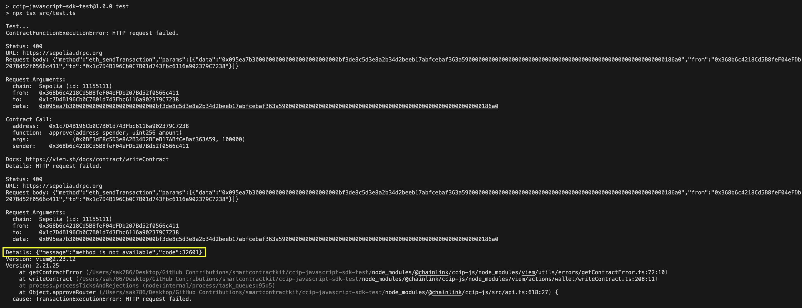

# CCIP-JAVASCRIPT-SDK-PACKAGE-TEST

The package is available at https://www.npmjs.com/package/@chainlink/ccip-js.

## Install the Dependencies 

```sh
npm install
```

## Execute the Test

1. Replace the `0x_PRIVATE_KEY` placeholder with your Sepolia testnet account private key (having `0x` prefix added).
2. Run the following command:
   
    ```sh
    npm run test
    ```

**NOTE:** The functions will be executed fine because the calls of the functions that are failing are commented out. 

## Steps to Reproduce the Error

1. Uncomment the `approveRouter` function call at [line 290](https://github.com/SyedAsadKazmi/ccip-javascript-sdk-test/blob/ac0efee5202cdd2bca1a0d48ab68c8bb7d0dec9b/src/test.ts#L290), and comment out all the other function calls, like:

    ```js
    approveRouter() // Failure: This occurred due to using an account address instead of an account object while calling the writeContract function. Details about the error can be found in the 'Discussions' tab of the Viem repository: https://github.com/wevm/viem/discussions/1452
    // getAllowance()
    // getOnRampAddress()
    // getSupportedFeeTokens()
    // getLaneRateRefillLimits()
    // getTokenRateLimitByLane()
    // getFee()
    // getTokenAdminRegistry()
    // isTokenSupported()
    // transferTokensPayLINK() // Failure: Same reason as in approveRouter()
    // transferTokensPayNative() // Failure: Same reason as in approveRouter()
    // getTransferStatus()
    // getTransactionReceipt()
    ```

2. Run the following command:
   
    ```sh
    npm run test
    ```

3. You'll encounter the following error:

    